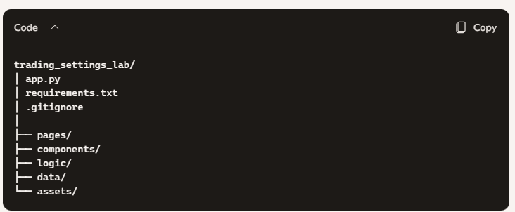

# Trading Settings Learning Lab

An interactive simulation platform for understanding how trading settings shape decisions.

Overview
The Trading Settings Learning Lab is an educational, simulation‑driven environment designed to help learners understand how platform settings, broker configurations, and personal trading profiles influence real‑time trading behavior.

Instead of focusing only on charts and indicators, this lab reveals the hidden layer of trading:

Execution settings

Spread behavior

Stop‑loss mechanics

Emotional load

Reflection and self‑awareness

Session‑based learning

Badges and progress tracking

Built with Streamlit, the platform is lightweight, interactive, and ideal for classrooms, workshops, and self‑paced learning.

Features
Learning Lab
Explore each trading setting with:

Clear explanations

Metaphors

Adjustment controls

Reflection prompts

Before/after examples

Broker Settings
Understand how:

Default size

Trigger spread

Stop‑loss spread

affect execution quality and risk.

Market Profile
Define your trading identity:

Level

Style

Privacy preferences

Simulation Arena
A safe, hands‑on environment to practice trading:

Step the market (1x, 2x, 5x)

Place Buy/Sell trades

Automatic stop‑loss handling

Spread‑based order blocking

Emotional meter

Execution markers on chart

Real‑time trade log

Risk summary

Badges and Progress
Earn badges for:

Spread awareness

Execution discipline

Learning‑first behavior

Trading engagement

Teacher Dashboard
Classroom‑friendly analytics:

Total sessions

Total trades

Reflections

Spread blocks

Stop‑loss hits

Emotional load chart

Keyword themes

Session Summary
Generate:

Narrative summaries

Learning objectives

Emotional load insights

Trade breakdowns

Compare Sessions
Compare two sessions side‑by‑side to identify:

Growth

Patterns

Repeated mistakes

Project Structure

Code
trading_settings_lab/
│ app.py
│ requirements.txt
│ .gitignore
│
├── pages/
├── components/
├── logic/
├── data/
└── assets/
Installation

1. Clone the repository
Code
git clone YOUR_REPO_URL_HERE
cd trading_settings_lab
2. Create a virtual environment
Code
python -m venv .venv
3. Activate it
Windows:

Code
.\.venv\Scripts\activate
macOS/Linux:

Code
source .venv/bin/activate
4. Install dependencies
Code
pip install -r requirements.txt
5. Run the app
Code
streamlit run app.py
Requirements
Code
streamlit
pandas
numpy
altair
plotly
scikit-learn
pyyaml
python-dateutil
Who This Lab Is For
Students learning trading fundamentals

Teachers running workshops

Beginners exploring market mechanics

Traders practicing emotional awareness

Anyone wanting to understand how settings influence behavior

Educational Philosophy
The lab is built on three pillars.

Awareness
Settings shape perception.
Perception shapes decisions.

Reflection
Trading is not just numbers — it is behavior.

Experimentation
Safe simulation encourages curiosity without fear.

Contributing
Contributions are welcome. You can improve:

UI and UX

Components

Logic modules

Data models

Documentation

Teaching tools

License

Add your preferred license here (MIT, Apache‑2.0, etc.).
